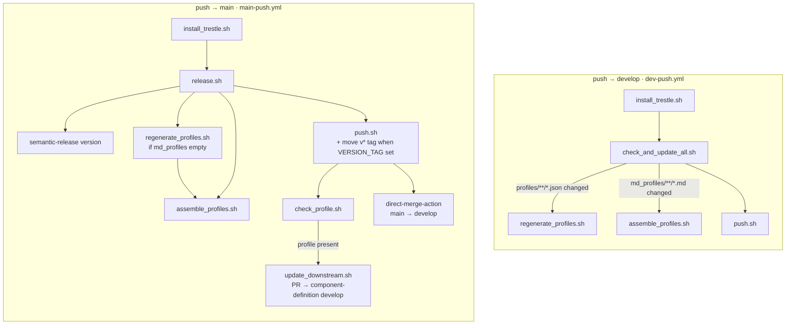
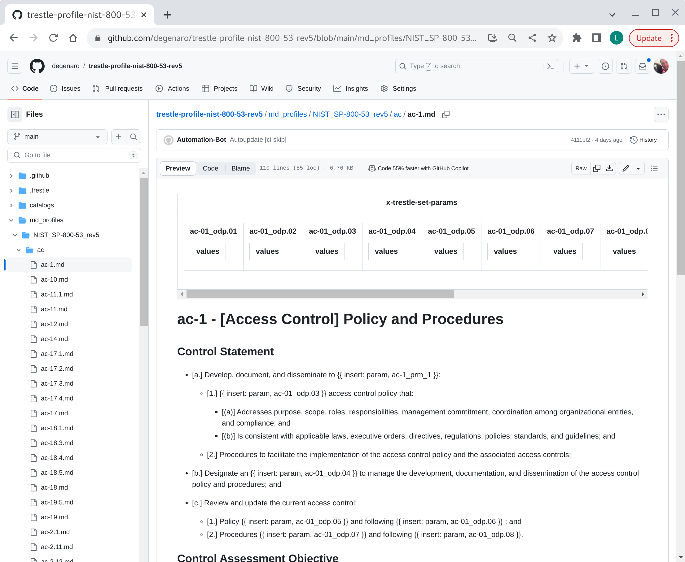
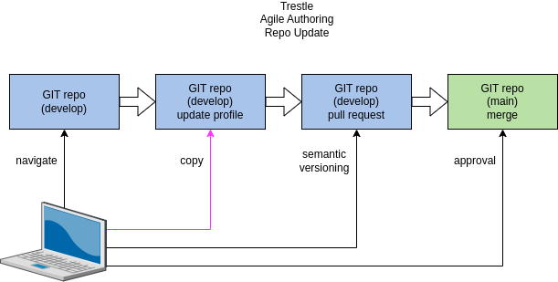
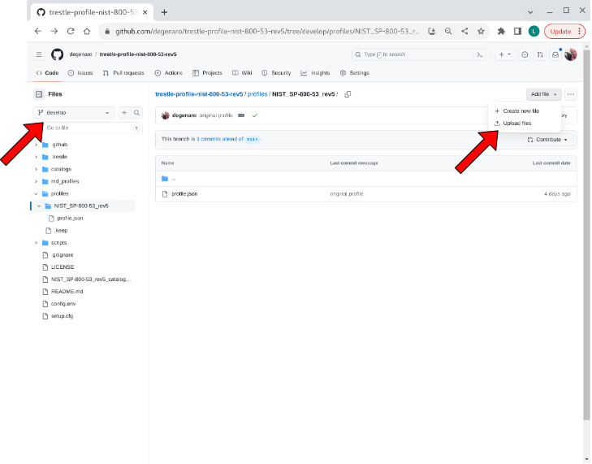
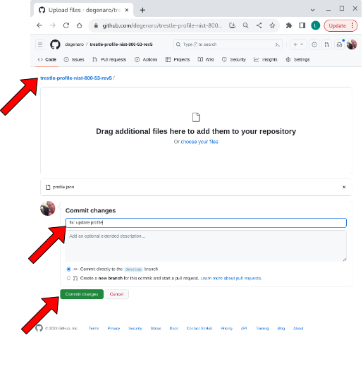
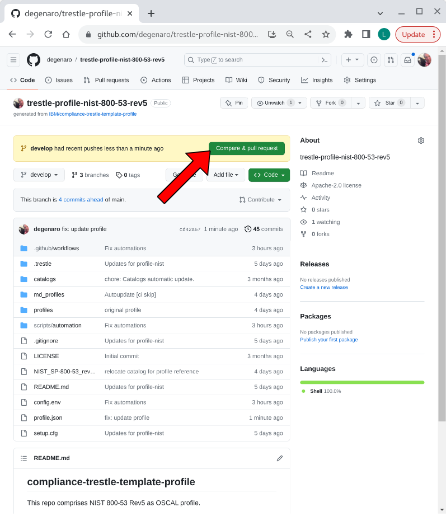
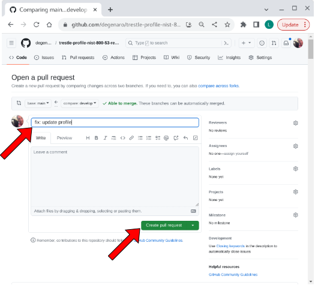
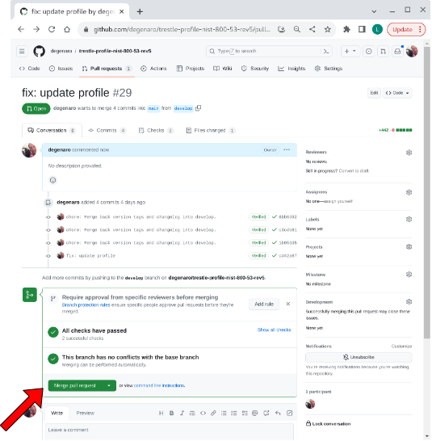
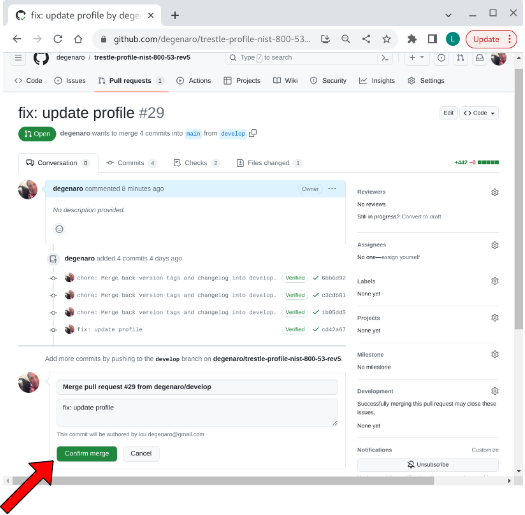

## compliance-trestle-profile

compliance-trestle repository for agile authoring of profile

Prerequisite: [profile template](https://github.com/IBM/compliance-trestle-template-profile) has been used to create repo for [agile authoring](https://github.com/IBM/compliance-trestle-agile-authoring).

- [view profile markdown](#view-profile-markdown)
- [update profile](#update-profile)
- [CI automation](#ci-automation)

-----

##### CI automation

Scripts under `scripts/automation/` run from GitHub Actions on push. Shared helpers are reused; branch decides the entrypoint.

| Script | develop | main |
| --- | --- | --- |
| `install_trestle.sh` | yes | yes |
| `check_and_update_all.sh` | entry | — |
| `release.sh` | — | entry |
| `regenerate_profiles.sh` | if JSON changed | if `md_profiles` empty |
| `assemble_profiles.sh` | if Markdown changed | always when content present |
| `push.sh` | Autoupdate commit | Autoupdate + optional tag move |
| `check_profile.sh` / `update_downstream.sh` | — | after release |

-----

##### view profile markdown

Navigate to the `md_profiles` folder, then descend to the control of interest.

visual

-----

##### update profile

Steps to modify the profile repository with an updated profile are given below:

###### 1. navigate to develop branch location of profile in repo.

visual

###### 2. copy updated profile to repo.

visual

###### 3. compare & pull request

visual

###### 4. create pull request

visual

###### 5. merge pull request

visual

###### 6. confirm merge

visual

-----

##### references

- [documentation: agile authoring](https://github.com/IBM/compliance-trestle-agile-authoring#compliance-trestle-agile-authoring)

______________________________________________________________________

We are a Cloud Native Computing Foundation sandbox project.

<picture>
  <source media="(prefers-color-scheme: dark)" srcset="https://www.cncf.io/wp-content/uploads/2022/07/cncf-white-logo.svg">
  
</picture>

The Linux Foundation® (TLF) has registered trademarks and uses trademarks. For a list of TLF trademarks, see [Trademark Usage](https://www.linuxfoundation.org/legal/trademark-usage).

*OSCAL Compass is an independent open source project. It is not affiliated with, endorsed by, or sponsored by the National Institute of Standards and Technology (NIST) or any other government agency.*

*OSCAL Compass was originally contributed by IBM.*
